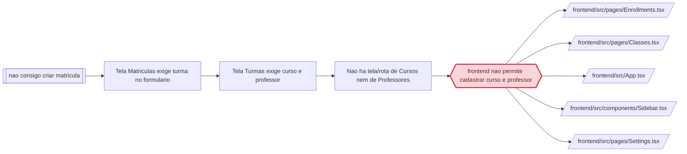

> `regressao_de` so e preenchido com EVIDENCIA de que o codigo causador deste problema foi introduzido ou alterado por aquele trabalho. Coincidencia de arquivo NAO e regressao: sem vinculo causal comprovado, `regressao_de: null` e `evidencia_regressao: null`, e a suspeita vai na prosa (regra 15). Preenchido um, preenchido o outro.

> Frontmatter obrigatorio (expx-schema v1). Formato completo em `references/00-schema.md`. Substitua os marcadores; NUNCA omita uma chave — ausente e `null`, lista vazia e `[]`. Sem acento em chave nem em valor de enum. `atualizado_em` e reescrito a cada gravacao.

## Cadeia da causa



# Causa raiz — OC-2026-0001: Nao consigo criar matricula

> Usado quando `tipo: bug`. Obrigatório PROVAR a causa, não supor. Hipótese sem prova não passa do E1.

STATUS: COMPROVADO

## Comportamento atual

O usuário não consegue criar matrícula porque a tela de matrículas exige uma turma (`Enrollments.tsx:111` — `if (!form.class_group_id) { setError('Selecione a turma'); return; }`), e a tela de turmas exige curso e professor (`Classes.tsx:139` — `if (!form.name || !form.course_id || !form.teacher_id) { alert('Preencha nome, curso e professor.'); return; }`), mas **o sistema não tem nenhuma tela, rota ou item de menu para cadastrar Cursos e Professores**:

- `frontend/src/App.tsx` não registra rotas `/courses` nem `/teachers`.
- `frontend/src/components/Sidebar.tsx` não lista "Cursos" nem "Professores" (menu fixo em `navGroups`, `Sidebar.tsx:12-46`).
- `coursesAPI.create` e `teachersAPI.create` existem (`api.ts:68,196`) mas nenhuma tela os chama — só `list()` é usado (em `Classes.tsx` para popular os selects).

Prova funcional em produção (2026-09-04, via API com login admin):
- `GET /api/courses` → `[]`; `GET /api/teachers` → `[]`; `GET /api/classes` → `[]`; `GET /api/enrollments` → `{"enrollments":[],"total":0}`.
- `POST /api/courses` → `{"id":2,"message":"Curso criado com sucesso"}`; `POST /api/teachers` → `{"id":2,"message":"Professor cadastrado com sucesso"}`; `POST /api/classes` → `{"id":1,"message":"Turma criada com sucesso"}`; `POST /api/enrollments` → `{"id":16,"message":"Matrícula realizada com sucesso"}`.

Ou seja: o backend está 100% funcional; o que falta é a interface para criar os pré-requisitos (curso e professor).

## Comportamento esperado

O usuário deve conseguir, pelo painel, cadastrar Cursos e Professores (itens de menu + rotas + telas de CRUD), e com eles criar Turmas, e com a turma criar Matrículas. Regra de negócio: turma é composta por nome + curso + professor (`class_group.py:12-13` — `course_id` e `teacher_id` NOT NULL); matrícula é aluno + turma (`enrollment.py:11-12` — NOT NULL).

## A prova

**Trecho de código identificado 1 — a tela de matrícula exige turma:**
```
if (!form.class_group_id) { setError('Selecione a turma'); return; }
```
`frontend/src/pages/Enrollments.tsx:111` — sem `class_group_id` o submit é bloqueado e o select de turma vem de `classesAPI.list()`; com zero turmas cadastradas, o select só tem a opção "Selecione a turma" (`Enrollments.tsx:138-140`).

**Trecho de código identificado 2 — a tela de turma exige curso e professor:**
```
if (!form.name || !form.course_id || !form.teacher_id) { alert('Preencha nome, curso e professor.'); return; }
```
`frontend/src/pages/Classes.tsx:139` — selects de curso (`Classes.tsx:165-171`) e professor (`Classes.tsx:177-179`) vêm de `coursesAPI.list()` e `teachersAPI.list()`; com zero cursos/professores, os selects ficam vazios e o botão de salvar fica desabilitado (`Classes.tsx:226`).

**Prova de ausência de UI — rotas e menu:**
- `git log --all --oneline -- frontend/src/pages/Courses.tsx frontend/src/pages/Teachers.tsx` → sem saída (nenhum commit na história).
- `frontend/src/App.tsx` — sem rotas `/courses`/`/teachers`.
- `frontend/src/components/Sidebar.tsx:12-46` — `navGroups` não contém itens de Cursos/Professores.

**Prova funcional (backend OK) — produção 2026-09-04:** cadeia `POST /courses` → `/teachers` → `/classes` → `/enrollments` retornou sucesso em todos os passos (ids: curso 2, professor 2, turma 1, matrícula 16). A prova funcional contradiz qualquer hipótese de defeito no backend.

## Regressão

**Não é regressão:** a investigação no versionador mostrou que os arquivos `frontend/src/pages/Courses.tsx` e `frontend/src/pages/Teachers.tsx` **nunca existiram** (`git log --all` sem resultados) e o menu/rotas nunca contiveram esses módulos. Não há trabalho anterior que tenha introduzido ou alterado o trecho causador — a ausência de UI é estrutural desde a origem. `regressao_de: null`.

## Arquivos e módulos impactados

> Esta lista TRAVA o escopo: o que não está aqui não é tocado no E3.

- `frontend/src/pages/Courses.tsx` — **criar** tela de CRUD de cursos (listar/criar/editar/excluir).
- `frontend/src/pages/Teachers.tsx` — **criar** tela de CRUD de professores.
- `frontend/src/App.tsx` — registrar rotas `/courses` e `/teachers`.
- `frontend/src/components/Sidebar.tsx` — adicionar itens "Cursos" e "Professores" ao menu.
- `frontend/src/services/api.ts` — já expõe `coursesAPI`/`teachersAPI` completos; sem mudança (ou apenas conferência de tipos).
- `frontend/src/pages/Settings.tsx` — adicionar as permissões `courses`/`teachers` à lista `ALL_PERMISSIONS` para controle de acesso por perfil (decisão D-03).
- `frontend/src/App.test.tsx` — **alterar**: casos de regressão das rotas `/courses` e `/teachers` (T-01.01) e caso de perfil sem permissão (T-01.04).
- `frontend/src/pages/__tests__/Courses.test.tsx` — **criar** teste da página de cursos (T-01.02).
- `frontend/src/pages/__tests__/Teachers.test.tsx` — **criar** teste da página de professores (T-01.03).

## Opções de solução consideradas

| Opção | Trade-off |
|---|---|
| Criar telas de Cursos e Professores + rotas + menu (E3) | Resolve a causa na origem; exige trabalho de UI; é o comportamento completo que o produto demanda |
| Remover a validação de turma na matrícula (criar matrícula sem turma) | Quebra o schema (`class_group_id` NOT NULL) e a regra de negócio; matrícula órfã |
| Criar curso/professor fake automaticamente (seed) | Polui dados; não resolve o gerenciamento real pelo usuário |
| Documentar "criar turma direto no banco" | Inviável para o cliente final |

## Decisões

> Formato fixo. Não apague decisões: uma decisão revertida ganha nova linha que cita a anterior.

```
D-01 | Causa raiz tratada no frontend: criar telas de Cursos e Professores e expor no menu/rotas | Tratar backend (endpoints já funcionam) | O bloqueio é de UI, comprovado em produção; backend responde corretamente
D-02 | Manter validações atuais (matrícula exige turma; turma exige curso+professor) | Afrouxar validações | Schema NOT NULL e regra de negócio; o caminho correto é viabilizar os pré-requisitos
D-03 | Adicionar as permissões courses e teachers à lista ALL_PERMISSIONS de Settings.tsx | Deixar os itens novos sem permission (visíveis a todos) | hasPermission no menu/rotas; sem a chave, nenhum perfil não-admin recebe acesso controlado aos módulos novos
```

## Como isso será testado

- **Teste de regressão (E2/E3):** casos novos em `frontend/src/App.test.tsx` que acessam `/courses` e `/teachers` como admin e exigem os títulos "Cursos" e "Professores" — falham (vermelho) com o código atual (o App redireciona para `/`) e passam (verde) após o fix (T-01.01 → T-01.04).
- **Testes de página (E3):** `Courses.test.tsx` e `Teachers.test.tsx` validam listagem, criação, edição e exclusão com a API mockada (padrão de `Classes.test.tsx`).
- **E2E de UI (browser):** após a implementação, verificar que o menu mostra "Cursos" e "Professores" e que é possível cadastrar um curso e um professor pela interface.
- **QA em produção:** repetir a cadeia pela UI (não mais por API) e confirmar que a matrícula é criada; cancelar e limpar os dados de teste (curso 2, professor 2, turma 1, matrícula 16) — sujeito ao bloqueio B-01.