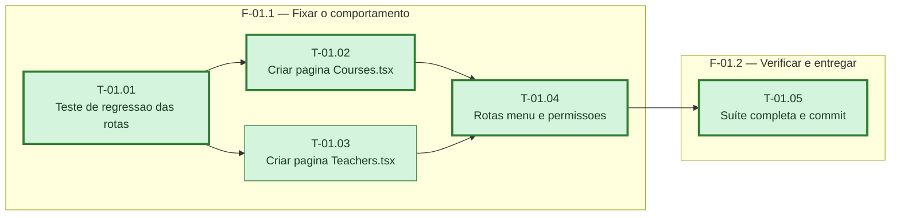

> Frontmatter obrigatorio (expx-schema v1). Formato completo em `references/00-schema.md`. Substitua os marcadores; NUNCA omita uma chave — ausente e `null`, lista vazia e `[]`. Sem acento em chave nem em valor de enum. `atualizado_em` e reescrito a cada gravacao.

## Grafo de tasks

> SUBSTITUA o bloco abaixo INTEIRO pelo grafo desta sprint, gerado no E2 pelas regras de `references/07-diagrama.md`. Um no por task (identificador trocando `-` e `.` por `_`: `T-01.01` → `T_01_01`), uma aresta `-->` por `depende_de`, um `subgraph` por fase, caminho critico na classe `critico`, status por cor, e a task do `teste_regressao` na classe `regressao`. Formato do rotulo: `"<id> <titulo cortado em 28>"`.
>
> As arestas ficam FORA dos subgraphs, depois do ultimo `end`. Sem `linkStyle`, sem `style` por no, sem aresta inventada a partir de `paralelizavel` — paralelismo e ausencia de aresta.
>
> Acima de 25 tasks na sprint: uma visao geral das fases mais um diagrama por fase, nunca um diagrama que nao caiba numa tela.
>
> O E3 atualiza SOMENTE as linhas `class` conforme o status de cada task muda. Diagrama e derivado: se ele nao for gerado, nada trava — mas se os campos se contradisserem (`paralelizavel: true` com `depende_de` nao vazio, seta para id inexistente, ciclo), NAO gere o bloco: reporte a contradicao como erro de plano.

# Fases — Sprint 01

> Um bloco por fase. Repita o bloco quantas vezes forem necessárias. O paralelismo declarado aqui é definitivo: a execução nunca decide paralelismo sozinha.

---

## F-01.1 — Fixar o comportamento

**Objetivo:** fixar via teste o comportamento ausente (rotas de Cursos e Professores), entregar as duas páginas de CRUD e expô-las no App, no menu e nas permissões.

**Tasks que a compõem:** T-01.01, T-01.02, T-01.03, T-01.04

**Critério de saída:** todos os testes novos (App.test.tsx, Courses.test.tsx, Teachers.test.tsx) passam com `npm test`, incluindo o teste de regressão que falhava antes do fix.

**Roda em paralelo com:** nenhuma

---

## F-01.2 — Verificar e entregar

**Objetivo:** provar que nada quebrou, fechar a sprint e gravar o fix na main.

**Tasks que a compõem:** T-01.05

**Critério de saída:** `npm run build` termina com exit 0 e `npm test` com 0 failed; commit com os artefatos da ocorrência gravado na main.

**Roda em paralelo com:** nenhuma