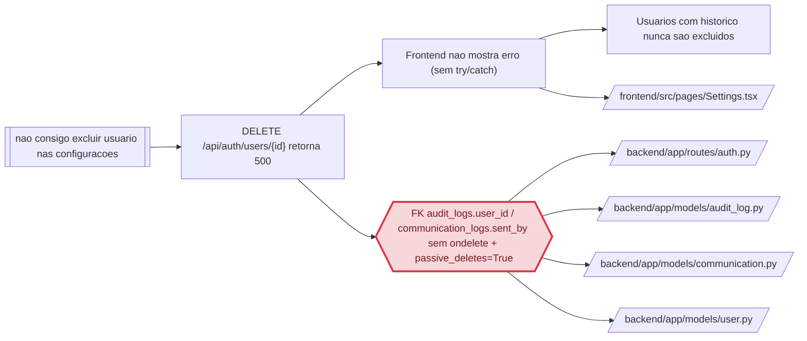

> `regressao_de` so e preenchido com EVIDENCIA de que o codigo causador deste problema foi introduzido ou alterado por aquele trabalho. Coincidencia de arquivo NAO e regressao: sem vinculo causal comprovado, `regressao_de: null` e `evidencia_regressao: null`, e a suspeita vai na prosa (regra 15). Preenchido um, preenchido o outro.

> Frontmatter obrigatorio (expx-schema v1). Formato completo em `references/00-schema.md`. Substitua os marcadores; NUNCA omita uma chave — ausente e `null`, lista vazia e `[]`. Sem acento em chave nem em valor de enum. `atualizado_em` e reescrito a cada gravacao.

## Cadeia da causa



# Causa raiz — OC-2026-0002: Usuarios nao sao excluidos nas configuracoes

> Usado quando `tipo: bug`. Obrigatório PROVAR a causa, não supor. Hipótese sem prova não passa do E1.

STATUS: COMPROVADO

## Comportamento atual

O botão "Excluir" da tela Configurações → Usuários **nunca remove o usuário** quando ele tem histórico no sistema. Dois defeitos se somam:

1. **Backend — IntegrityError em qualquer usuário com histórico:** as tabelas `audit_logs` (`audit_log.py:11` — `user_id = Column(Integer, ForeignKey("users.id"))`) e `communication_logs` (`communication.py:14` — `sent_by = Column(Integer, ForeignKey("users.id"))`) referenciam `users.id` **sem `ondelete`**. O model `User` declara `audit_logs = relationship("AuditLog", back_populates="user", passive_deletes=True)` (`user.py:25`) — `passive_deletes=True` diz ao SQLAlchemy para NÃO carregar os filhos e confiar na cascade do banco, mas a cascade **não existe** na FK. Resultado: `db.delete(user)` (em `auth.py:293`) dispara `DELETE FROM users` e o Postgres recusa com `IntegrityError: FOREIGN KEY constraint failed` → a rota retorna 500.

2. **Frontend — falha silenciosa:** `Settings.tsx:85-89`:
```tsx
const handleDeleteUser = async (id: number) => {
  if (!confirm('Excluir este usuário?')) return;
  await authAPI.deleteUser(id);
  setUsers(u => u.filter(user => user.id !== id));
};
```
Sem `try/catch`, a rejeição da promise (HTTP 500) vira unhandled rejection — a interface não mostra erro, a lista não muda, e o usuário conclui que "não está excluindo usuários".

## Comportamento esperado

- Excluir um usuário em Configurações deve funcionar para qualquer usuário (com ou sem histórico), mantendo a trilha de auditoria e os registros de comunicação íntegros (a atribuição ao usuário excluído é removida, os eventos permanecem).
- Antes de excluir, deve abrir uma **tela/modal de confirmação** com mensagem clara e botão de ação em vermelho (ou amarelo), dando segunda chance (pedido explícito do usuário).
- O backend não deve permitir a exclusão do **último admin ativo** (evita lockout irreversível).

## A prova

**Teste de regressão criado e executado (T-01.01 — E1, VERMELHO):** `backend/tests/test_user_delete_regression.py` reproduz o cenário: cria usuário com registro de auditoria, ativa `PRAGMA foreign_keys=ON` (espelha o Postgres de produção) e chama `DELETE /api/auth/users/{id}`. Resultado:

```
E sqlalchemy.exc.IntegrityError: (sqlite3.IntegrityError) FOREIGN KEY constraint failed
E [SQL: DELETE FROM users WHERE users.id = ?]
E [parameters: (2,)]
```
`FAILED tests/test_user_delete_regression.py::test_delete_usuario_com_historico — 1 failed in 9.68s`

Qualquer usuário que já fez login ou qualquer ação tem linhas em `audit_logs` (o login grava via `log_audit`, `auth.py:114`) — portanto **todo usuário em uso cai no IntegrityError**.

**Trecho de código identificado 1 — FK sem ondelete + passive_deletes:**
```
audit_logs = relationship("AuditLog", back_populates="user", passive_deletes=True)   # user.py:25
user_id = Column(Integer, ForeignKey("users.id"))                                    # audit_log.py:11
sent_by = Column(Integer, ForeignKey("users.id"))                                    # communication.py:14
```

**Trecho de código identificado 2 — falha silenciosa no frontend:**
```
await authAPI.deleteUser(id);   // Settings.tsx:87 — sem try/catch; 500 vira unhandled rejection
```

**Prova de que não é regressão:** `git log` recente não mostra trabalho anterior que tenha introduzido essas FKs sem `ondelete` — o modelo nasceu assim (estrutural, não regressão). `regressao_de: null`. Suspeita registrada: caso um dia exista migração que adicione `ondelete`, esta causa muda de natureza — ver L-01.

## Regressão

**Não é regressão:** os FKs sem `ondelete` e o `handleDeleteUser` sem `try/catch` existem desde a criação do módulo de usuários; nenhuma ocorrência ou feature anterior alterou esses trechos. `regressao_de: null`.

## Arquivos e módulos impactados

> Esta lista TRAVA o escopo: o que não está aqui não é tocado no E3.

**Backend (fix da causa):**
- `backend/app/routes/auth.py` — **alterar** `delete_user`: limpar dependências antes do `db.delete` (audit_logs → SET NULL, communication_logs → SET NULL) + guarda do último admin ativo.
- `backend/app/models/audit_log.py` — **alterar** FK `user_id` para `ondelete="SET NULL"`.
- `backend/app/models/communication.py` — **alterar** FK `sent_by` para `ondelete="SET NULL"`.
- `backend/tests/test_user_delete_regression.py` — **criado** no E1 (RED); vira GREEN no E3. Pode ganhar casos extras (sem histórico, comunicação, último admin).

**Frontend (confirmacao de exclusao):**
- `frontend/src/components/ConfirmDialog.tsx` — **criar** componente reutilizável (modal: mensagem + botão vermelho/amarelo + cancelar).
- `frontend/src/pages/Settings.tsx` — **alterar**: `handleDeleteUser` com try/catch + trocar `window.confirm` pelo `ConfirmDialog`.
- `frontend/src/pages/Carnes.tsx`, `Contratos.tsx`, `Planos.tsx`, `Evaluations.tsx`, `Financial.tsx`, `Schedule.tsx` — **alterar**: substituir `window.confirm` (ou ausência de confirmação) pelo `ConfirmDialog`.
- `frontend/src/pages/Courses.tsx`, `Teachers.tsx`, `Students.tsx`, `Classes.tsx` — **alterar**: substituir os botões inline "Sim" pelo `ConfirmDialog` (consistência).

## Opções de solução consideradas

| Opção | Trade-off |
|---|---|
| Limpeza explícita na rota (SET NULL nas dependências) antes do delete | Funciona no banco existente SEM migração; preserva trilha/registros; é o fix minimalista da causa |
| Só adicionar `ondelete="CASCADE"` nas FKs | Exige ALTER TABLE no banco de produção (sem acesso, B-01); apagaria histórico de auditoria |
| Deletar dependências (DELETE em audit_logs) | Perde trilha de auditoria do usuário excluído — fere o propósito do módulo de auditoria |
| Soft-delete (is_active=false) | Não atende o pedido explícito "excluir usuário"; acumula contas inativas |
| Manter window.confirm | Não atende o pedido de "tela com mensagem... botão vermelho/amarelo" |

## Decisões

> Formato fixo. Não apague decisões: uma decisão revertida ganha nova linha que cita a anterior.

```
D-01 | Limpeza explícita das dependências na rota delete_user (SET NULL em audit_logs/communication_logs) antes do db.delete | Só adicionar ondelete CASCADE nas FKs (depende de migração) | Funciona no banco existente sem acesso ao schema; preserva histórico; fix minimalista e comprovado por teste
D-02 | Models ganham ondelete="SET NULL" nas FKs (audit_logs.user_id, communication_logs.sent_by) | CASCADE | Instalações novas via create_all já nascem corretas; SET NULL preserva os eventos, só remove a atribuição
D-03 | Componente ConfirmDialog reutilizável aplicado a todas as telas com exclusão destrutiva | Manter window.confirm/inline | Pedido explícito do usuário; consistência de UX
D-04 | try/catch no handleDeleteUser com alerta de erro | Manter unhandled rejection | Elimina o sintoma "não exclui e não avisa"
D-05 | Backend bloqueia exclusão do último admin ativo (400) | Permitir | Evita lockout irreversível do sistema
```

## Como isso será testado

- **Teste de regressão (já VERMELHO, E1):** `backend/tests/test_user_delete_regression.py` — usuário com audit_logs → DELETE retorna 200 e o usuário some do banco (GREEN após D-01).
- **Testes novos no backend (E3):** usuário sem histórico continua sendo excluído; registros de comunicação preservados com `sent_by` nulo; bloqueio do último admin ativo (400) e da auto-exclusão (400 já existente); caso de usuário que não existe (404 já existente).
- **Testes no frontend (E3):** `Settings.test.tsx` (padrão de `App.test.tsx`/`Classes.test.tsx`) — modal de confirmação abre ao clicar Excluir, cancela não chama a API, confirma chama `authAPI.deleteUser`, erro do backend exibe alerta. Teste do `ConfirmDialog` isolado.
- **Suite completa:** `pytest` no backend (49 testes atuais + novos) e `vitest` no frontend (23 testes atuais + novos) devem ficar verdes; `npm run build` (tsc + vite) exit 0.
- **QA em produção (E4):** excluir usuário de teste com e sem histórico pela UI; conferir 200 e remoção da lista; conferir que a trilha de auditoria do admin permanece. Bloqueio B-02 (senha admin) se aplica — pedir credenciais ao usuário.