> Frontmatter obrigatorio (expx-schema v1). Formato completo em `references/00-schema.md`. Substitua os marcadores; NUNCA omita uma chave — ausente e `null`, lista vazia e `[]`. Sem acento em chave nem em valor de enum. `atualizado_em` e reescrito a cada gravacao.

## Grafo de tasks

> Parcialmente gerado no E2 (diagrama derivado de tasks.md). E3 atualiza somente as linhas `class`. Contradição entre campos = erro de plano, não gere diagrama.

```mermaid
%% Grafo de tasks — sprint-01 — OC-2026-0002
flowchart LR
  subgraph fase_01_1["F-01.1 — Corrigir exclusao no backend"]
    T_01_01["T-01.01<br/>Regressao delete usuario<br/>com historico"]
    T_01_02["T-01.02<br/>Fix delete_user + models"]
  end
  subgraph fase_01_2["F-01.2 — Confirmacao no frontend"]
    T_01_03["T-01.03<br/>ConfirmDialog + teste"]
    T_01_04["T-01.04<br/>Settings + teste"]
    T_01_05["T-01.05<br/>Demais telas com exclusao"]
  end
  subgraph fase_01_3["F-01.3 — Verificar e entregar"]
    T_01_06["T-01.06<br/>Suite build commit push"]
  end
  T_01_01 --> T_01_02
  T_01_02 --> T_01_03
  T_01_03 --> T_01_04
  T_01_04 --> T_01_05
  T_01_05 --> T_01_06

  classDef concluida fill:#d4f4dd,stroke:#2e7d32,color:#1b3d20
  classDef andamento fill:#fff3cd,stroke:#b8860b,color:#4a3800
  classDef bloqueada fill:#f8d7da,stroke:#c62828,color:#4a1d1f
  classDef pendente  fill:#eceff1,stroke:#78909c,color:#263238
  classDef critico   stroke-width:3px
  classDef regressao fill:#ede4ff,stroke:#6a1b9a,color:#3d1a78,stroke-width:3px

  class T_01_01,T_01_02,T_01_03,T_01_04,T_01_05,T_01_06 concluida
  class T_01_01,T_01_02,T_01_03,T_01_04,T_01_05,T_01_06 critico
  class T_01_01 regressao
```

# Fases — Sprint 01

---

## F-01.1 — Corrigir exclusao no backend

**Objetivo:** eliminar o IntegrityError no `DELETE /api/auth/users/{id}` quando o usuário tem histórico (audit_logs / communication_logs), com limpeza explícita das dependências antes do delete, e bloquear a exclusão do último admin ativo.

**Tasks que a compõem:** T-01.01, T-01.02

**Critério de saída:** `test_user_delete_regression.py` (que falhava no E1) fica verde; os casos extras passam com `pytest` (49 atuais + novos, 0 failed).

**Roda em paralelo com:** nenhuma

---

## F-01.2 — Confirmacao de exclusao no frontend

**Objetivo:** criar o componente `ConfirmDialog` (modal de confirmação com botão vermelho/amarelo) e aplicá-lo em Settings (usuários — com try/catch no handleDeleteUser) e nas demais telas com exclusão destrutiva.

**Tasks que a compõem:** T-01.03, T-01.04, T-01.05

**Critério de saída:** `ConfirmDialog` criado e usado em todas as telas de exclusão; `vitest` com os testes novos verdes (23 atuais + novos, 0 failed).

**Roda em paralelo com:** nenhuma

---

## F-01.3 — Verificar e entregar

**Objetivo:** provar que nada quebrou (backend + frontend), fechar a sprint e gravar/empurrar o fix na main.

**Tasks que a compõem:** T-01.06

**Critério de saída:** `pytest` 0 failed, `vitest` 0 failed, `npm run build` exit 0, commit + push na main.

**Roda em paralelo com:** nenhuma