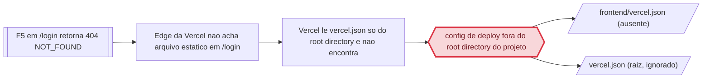

> `regressao_de` so e preenchido com EVIDENCIA de que o codigo causador deste problema foi introduzido ou alterado por aquele trabalho. Coincidencia de arquivo NAO e regressao: sem vinculo causal comprovado, `regressao_de: null` e `evidencia_regressao: null`, e a suspeita vai na prosa (regra 15). Preenchido um, preenchido o outro.

> Frontmatter obrigatorio (expx-schema v1). Formato completo em `references/00-schema.md`. Substitua os marcadores; NUNCA omita uma chave — ausente e `null`, lista vazia e `[]`. Sem acento em chave nem em valor de enum. `atualizado_em` e reescrito a cada gravacao.

## Cadeia da causa

Do sintoma relatado até a causa: `S1` o sintoma, `P1..P2` os pontos percorridos, `C1` a causa comprovada, `A1..A2` os arquivos impactados. `regressao_de` vazio: nenhum trabalho registrado introduziu o código (suspeita vai na seção Regressão).



# Causa raiz — OC-2026-0004 Erro NOT_FOUND ao atualizar

> Usado quando `tipo: bug`. Obrigatório PROVAR a causa, não supor. Hipótese sem prova não passa do E1.

STATUS: COMPROVADO

## Comportamento atual

O frontend de produção está com o deploy da Vercel sem os rewrites e sem o fallback SPA:

- `vercel.json:1-18` (raiz do repo) define `rewrites` de `/api/:path*` e `/uploads/:path*` para o backend Render e o fallback `/(.*)` → `/index.html`, mas a Vercel não os aplica.
- `frontend/.vercel/project.json` aponta para o projeto Vercel `prj_RANJgKpUDVwHczWNBc12R98raysc` (nome `jgsistemas`), o mesmo `projectId` do `.vercel/project.json` da raiz — o deploy está ancorado na pasta `frontend/`.
- O histórico (`git log -- frontend/vercel.json`) mostra o arquivo vivendo em `frontend/` (commits `1d157ce`, `bc9b278`, `3d66a7b`); o commit `ed9d1f6` (2026-08-24) o moveu para a raiz.
- Observação empírica (navegador, 2026-09-05): `GET https://jgsistemas.dev.br/login` → **404** (página de erro da Vercel); `GET https://jgsistemas.dev.br/` → 200; `GET https://jgsistemas.dev.br/api/health` → **404**; `GET https://jgsistemas-backend.onrender.com/api/health` → **200** `{"status":"ok","message":"Sistema de gestão escolar"}`; `POST https://jgsistemas.dev.br/api/auth/login` → **404** `The page could not be found`.

## Comportamento esperado

- `GET /login` → 200 com o HTML da SPA (fallback `/(.*)` → `/index.html`), e o React Router renderiza a página client-side.
- `GET /api/health` → 200 com a resposta do backend (rewrite `/api/:path*` → Render).
- `POST /api/auth/login` → resposta do backend: 200+token ou 401 para credenciais inválidas — nunca 404 de rota inexistente.

Contrato que sustenta a expectativa: o frontend é uma SPA (React + Vite) com rotas client-side, e o backend vive fora da Vercel (Render). Sem o fallback e os rewrites no `vercel.json` que a Vercel realmente lê, toda navegação direta (F5, link compartilhado) e toda chamada `/api/*` quebra.

## A prova

**Teste que reproduz e falha:**
```
GET  https://jgsistemas.dev.br/login                    -> HTTP 404 (página de erro da Vercel)
GET  https://jgsistemas.dev.br/                          -> HTTP 200
GET  https://jgsistemas.dev.br/api/health                -> HTTP 404
GET  https://jgsistemas-backend.onrender.com/api/health  -> HTTP 200 {"status":"ok","message":"Sistema de gestão escolar"}
POST https://jgsistemas.dev.br/api/auth/login            -> HTTP 404 "The page could not be found"
```

**Log / resposta que evidencia o erro (colado literalmente):**
```
404: NOT_FOUND
Code: NOT_FOUND
ID: gru1::z5c6x-1788619900627-898978dd9a64
Read our documentation to learn more about this error.
https://vercel.com/docs/errors/NOT_FOUND
```
O template e o request ID `gru1::` são da edge da Vercel — não do Supabase.

**Trecho de código identificado:**
```json
{
  "$schema": "https://openapi.vercel.sh/vercel.json",
  "buildCommand": "cd frontend && npm ci && npm run build",
  "outputDirectory": "frontend/dist",
  "rewrites": [
    { "source": "/api/:path*", "destination": "https://jgsistemas-backend.onrender.com/api/:path*" },
    { "source": "/uploads/:path*", "destination": "https://jgsistemas-backend.onrender.com/uploads/:path*" },
    { "source": "/(.*)", "destination": "/index.html" }
  ]
}
```
`vercel.json:1-18` (raiz) — a Vercel lê o `vercel.json` apenas dentro do **root directory** do projeto. O projeto está ancorado em `frontend/` (`frontend/.vercel/project.json` com o mesmo `projectId`; o arquivo histórico vivia em `frontend/` até o commit `ed9d1f6`). Com o `vercel.json` na raiz e o root directory = `frontend/`, nada é aplicado: `GET /login` (rota SPA) cai no 404 da edge e `GET /api/health` não é reescrito para o Render — o backend está no ar, é o rewrite que não existe.

## Regressão

**Não é regressão:** o trecho responsável (a remoção de `frontend/vercel.json` e a criação do `vercel.json` na raiz) foi introduzido pelo commit `ed9d1f6` (2026-08-24, "Move config Vercel p/ raiz (root build delega ao frontend) e adiciona fallback SPA"). Não há evidência de que esse commit pertença a um trabalho registrado (as OCs registradas no repo — OC-2026-0001..0003 — são `docs(runx)` e não tocam esse arquivo). Sem vínculo causal com trabalho registrado, `regressao_de: null` — a suspeita do `ed9d1f6` fica registrada aqui.

## Arquivos e módulos impactados

> Esta lista TRAVA o escopo: o que não está aqui não é tocado no E3.

- `frontend/vercel.json` — criar com os rewrites `/api/:path*` e `/uploads/:path*` (→ Render) e o fallback SPA `/(.*)` → `/index.html`
- `vercel.json` (raiz) — remover (config ignorada pela Vercel; dupla fonte de verdade)
- `frontend/src/__tests__/vercelConfig.test.ts` — teste de regressão que valida os rewrites e o fallback no `frontend/vercel.json` (falha hoje, arquivo inexistente)

## Opções de solução consideradas

| Opção | Trade-off |
|---|---|
| Criar `frontend/vercel.json` (rewrites + fallback SPA) e remover o da raiz | Restaura o comportamento que funcionava, adiciona o fallback que faltava, config versionável no repo; exige novo deploy para valer |
| Mudar o Root Directory no dashboard da Vercel para a raiz (mantendo `vercel.json` na raiz) | Config inteira na raiz; depende de acesso ao dashboard (sem token no runx) e deixa o build delegado ao `buildCommand` — fora do repo, mais frágil |

## Decisões

> Formato fixo. Não apague decisões: uma decisão revertida ganha nova linha que cita a anterior.

```
D-01 | Criar `frontend/vercel.json` com rewrites `/api`, `/uploads` (-> Render) e fallback SPA `/(.*)` -> `/index.html` | Mudar o Root Directory no dashboard da Vercel para a raiz | Config de deploy deve viver no repositório (versionável e revisável); o dashboard não é acessível ao runx; o histórico mostra o arquivo sempre em `frontend/`
D-02 | Remover `vercel.json` da raiz do repo | Manter os dois arquivos (raiz e frontend/) | O arquivo da raiz é ignorado pela Vercel (root directory = `frontend/`) e cria dupla fonte de verdade para a manutenção
```

## Como isso será testado

- **Regressão (do bug):** verificação HTTP em produção após o redeploy — `GET https://jgsistemas.dev.br/login` → 200 com HTML da SPA; `GET /api/health` → 200 (proxy para o Render); `POST /api/auth/login` → resposta do backend (nunca 404 de rota).
- **Integração:** teste que lê `frontend/vercel.json` e valida a presença dos rewrites `/api/:path*`, `/uploads/:path*` e do fallback `/(.*)` → `/index.html` — falha hoje (arquivo inexistente), passa após o fix.
- **Funcional:** F5 em `/login` no navegador não exibe mais a página de erro 404 da Vercel; login real funciona (token ou 401, nunca 404).