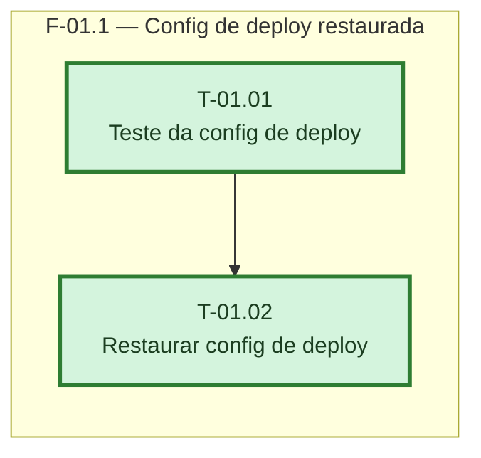

> Frontmatter obrigatorio (expx-schema v1). Formato completo em `references/00-schema.md`. Substitua os marcadores; NUNCA omita uma chave — ausente e `null`, lista vazia e `[]`. Sem acento em chave nem em valor de enum. `atualizado_em` e reescrito a cada gravacao.

## Grafo de tasks

# Fases — Sprint 1

> Um bloco por fase. Repita o bloco quantas vezes forem necessárias. O paralelismo declarado aqui é definitivo: a execução nunca decide paralelismo sozinha.

---

## F-01.1 — Config de deploy restaurada

**Objetivo:** fazer a Vercel voltar a ler os rewrites e o fallback SPA dentro do root directory (`frontend/`).

**Tasks que a compõem:** T-01.01, T-01.02

**Critério de saída:** teste de regressão falha antes e passa depois; suíte inteira verde (`npm test` em `frontend/`); `vercel.json` da raiz removido.

**Roda em paralelo com:** nenhuma