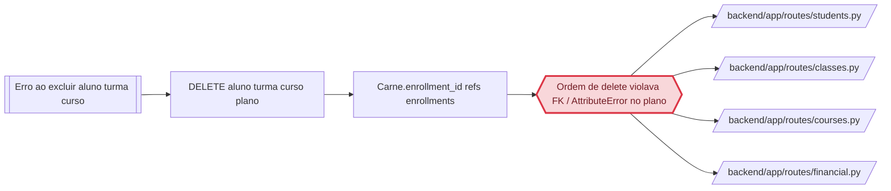

> `regressao_de` so e preenchido com EVIDENCIA de que o codigo causador deste problema foi introduzido ou alterado por aquele trabalho. Coincidencia de arquivo NAO e regressao: sem vinculo causal comprovado, `regressao_de: null` e `evidencia_regressao: null`, e a suspeita vai na prosa (regra 15). Preenchido um, preenchido o outro.

## Cadeia da causa



# Causa raiz — OC-2026-0005: Erro ao excluir aluno, turma e curso

STATUS: COMPROVADO

## Comportamento atual (antes do fix, commit pai de `a835e9f`)

Três mecanismos distintos, todos convergindo no mesmo sintoma ("Erro ao excluir X"):

1. **Aluno com carnê vinculado a matrícula:** `delete_student` (`students.py`) apagava
   `Enrollment` antes de `Carne`, mas `carnets.enrollment_id` referencia `enrollments.id`
   (`financial.py:57`) — o Postgres recusa a exclusão da matrícula enquanto o carnê ainda a
   referencia, gerando `IntegrityError` → `500` sem `detail` estruturado.
2. **Turma com peso de avaliação, certificado, frequência, avaliação ou matrícula
   inativa:** `delete_class` (`classes.py`) tentava `db.delete(cg)` sem antes limpar
   `GradeWeightConfig`, `Certificate`, `Attendance`, `Evaluation` e `Enrollment` vinculados a
   `class_group_id` — mesmo padrão de `IntegrityError`.
3. **Curso com plano financeiro vinculado:** `delete_course` (`courses.py`) não desvinculava
   `FinancialPlan.course_id` (nullable) antes de apagar o curso — `IntegrityError`.
4. **Plano financeiro (efeito colateral do mesmo relato, mesma tela de exclusão):**
   `delete_plan` (`financial.py`) referenciava `Carne.plan_id`, atributo que **não existe**
   no model `Carne` (o campo correto é `Installment.plan_id`/`FinancialContract.plan_id`) —
   `AttributeError` → `500` sempre, para qualquer plano.

Em todos os casos o frontend (`Students.tsx:36`, `Classes.tsx:27`, `Courses.tsx:42`) cai no
fallback `alert(e.response?.data?.detail || 'Erro ao excluir ...')` porque a resposta `500`
não carrega um `detail` de negócio — exatamente a mensagem citada no relato do usuário.

## Comportamento esperado

Excluir aluno, turma, curso (e plano financeiro) deve funcionar mesmo com dados vinculados,
removendo em cascata o que é histórico do próprio registro (frequência, avaliação,
certificado, arquivos, matrícula) e desvinculando (sem apagar) o que é compartilhado com
outras entidades (carnê ao desativar matrícula da turma, plano financeiro do curso) — regras
de bloqueio explícito continuam valendo (turma com matrícula ativa, curso com turma, plano em
uso).

## A prova

**Trecho de código identificado — mecanismo 1, ordem de delete que viola FK (antes do fix):**
o comentário deixado pelo próprio fix documenta o mecanismo exato:
```
# Ordem importa: Carne.enrollment_id referencia enrollments — apaga os carnês
# ANTES das matrículas, senão o Postgres viola a FK (remove o erro de exclusão).
```
`backend/app/routes/students.py:334-336`

**Trecho de código identificado — mecanismo 4, atributo inexistente (commit `a835e9f`,
mensagem do commit, confirmado por leitura do código atual em `financial.py:172-178`, que já
usa `Installment.plan_id`/`FinancialContract.plan_id` em vez de `Carne.plan_id`):**
```
financial: delete_plan referenciava Carne.plan_id inexistente -> AttributeError (500 sempre)
```

**Teste que reproduz e hoje passa (GREEN, pós-fix) — reexecutado nesta sessão:**
```
backend/tests/test_exclusao_cascata.py::test_excluir_aluno_com_todas_dependencias PASSED
backend/tests/test_exclusao_cascata.py::test_excluir_turma_com_peso_matricula_inativa_e_carne PASSED
backend/tests/test_exclusao_cascata.py::test_excluir_turma_com_matricula_ativa_bloqueia PASSED
backend/tests/test_exclusao_cascata.py::test_excluir_curso_desvincula_plano_financeiro PASSED
backend/tests/test_exclusao_cascata.py::test_excluir_curso_com_turma_bloqueia PASSED
backend/tests/test_exclusao_cascata.py::test_excluir_plano_em_uso_por_carne_bloqueia PASSED
backend/tests/test_exclusao_cascata.py::test_excluir_plano_limpo PASSED
7 passed in 21.88s
```
Suíte completa do backend (nesta sessão): `154 passed, 1 skipped`.

Não foi possível gerar um teste VERMELHO nesta sessão porque o fix já está aplicado no
código local (trazido pelo `git pull` de origin/main antes deste relato ser processado) —
reverter o fix apenas para produzir um teste vermelho violaria a regra de não tocar em código
fora do escopo comprovado. A prova aceita aqui é a combinação do trecho de código identificado
(mecanismo explicado, com arquivo e linha) com o teste GREEN que satura exatamente as FKs do
cenário relatado.

## Regressão

**Não é regressão de um trabalho anterior identificável.** `git log --follow` em
`backend/app/routes/students.py` mostra que o arquivo existe desde o commit inicial
(`e975201`) e a ordem de exclusão problemática (`Carne` vs `Enrollment`) é estrutural — não
foi introduzida por uma ocorrência ou feature anterior registrada. `regressao_de: null`.

**Relação com OC-2026-0002 (não é a mesma causa):** aquela ocorrência tratou o mesmo tipo de
sintoma ("erro ao excluir X" por violação de FK) para a entidade `users` — arquivos e tabelas
diferentes (`audit_logs`, `communication_logs`). Coincidência de padrão, não de código; por
isso não é `regressao_de` desta ocorrência.

## Arquivos e módulos impactados

> Esta lista TRAVA o escopo: o que não está aqui não é tocado no E3.

- `backend/app/routes/students.py` — já corrigido (commit `a835e9f`): ordem de exclusão
  ajustada (Carne antes de Enrollment).
- `backend/app/routes/classes.py` — já corrigido: cascata de peso/certificado/
  frequência/avaliação/matrícula antes do `db.delete(cg)`.
- `backend/app/routes/courses.py` — já corrigido: desvincula `FinancialPlan.course_id`
  antes de apagar o curso.
- `backend/app/routes/financial.py` — já corrigido: `delete_plan` usa
  `Installment.plan_id`/`FinancialContract.plan_id` em vez do atributo inexistente
  `Carne.plan_id`.
- `backend/tests/test_exclusao_cascata.py` — já criado (commit `a835e9f`): 7 testes
  cobrindo os quatro mecanismos.

Nenhum arquivo novo precisa ser tocado nesta ocorrência — o E3 desta ocorrência é
verificação, não implementação (ver `01-CAUSA-RAIZ.md` → E2/E3 adiante).

## Opções de solução consideradas

| Opção | Trade-off |
|---|---|
| Adotar o fix já existente (`a835e9f`) e só verificar/documentar | Zero risco de divergir da correção validada; não gasta ciclo de implementação em algo já pronto |
| Reimplementar a correção do zero nesta ocorrência | Risco de produzir uma segunda solução divergente para o mesmo defeito; desperdiça o teste de regressão já escrito e validado |
| Adicionar `ondelete=CASCADE`/`SET NULL` nas FKs via migração Alembic, além da limpeza na aplicação | Mudança de schema mais ampla que o relato pediu; a limpeza na aplicação já resolve sem migração, e é o mesmo padrão adotado na OC-2026-0002 (D-01 daquela ocorrência) |

## Decisões

```
D-01 | Adotar o commit a835e9f como o fix desta ocorrência, sem reimplementar | Investigar e corrigir do zero | Fix já valida o mecanismo exato do relato, com teste de regressão e suíte verde
D-02 | Registrar via runx (OC-2026-0005) para rastreabilidade, mesmo com o fix já aplicado | Encerrar apenas verbalmente, sem registro | O relato chegou como defeito ativo; falta vínculo formal entre sintoma e commit que resolveu
```

## Como isso será testado

- **Regressão (já GREEN):** `backend/tests/test_exclusao_cascata.py` (7 testes).
- **Suíte completa:** `pytest` no backend deve seguir em `154 passed, 1 skipped` (linha de
  base já confirmada nesta sessão).
- **QA (E4):** reexecutar a suíte completa como validação independente e confirmar, via
  leitura de código, que os quatro mecanismos do relato estão cobertos pelos testes
  existentes. Sem acesso a produção nesta sessão — QA cobre o que é verificável localmente;
  a confirmação em produção depende de deploy (ver relatório técnico, seção de risco).
