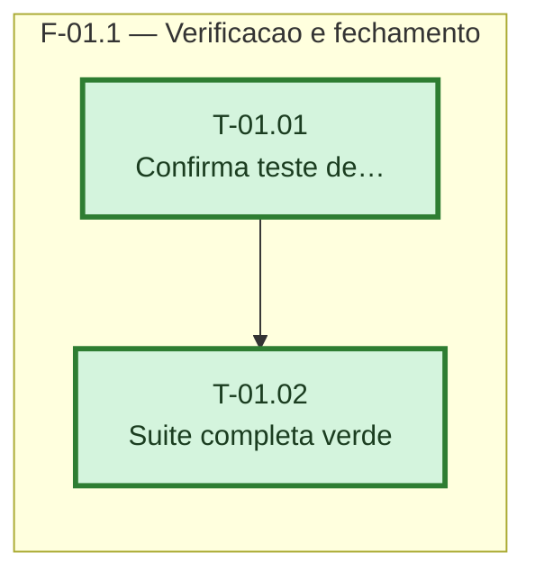

# Fases — Sprint 01 — OC-2026-0005

## F-01.1 — Verificação e fechamento

**Objetivo:** comprovar que o fix já presente no código (commit `a835e9f`) cobre o cenário
relatado, com o teste de regressão específico e a suíte completa verdes.

**Tasks:** T-01.01, T-01.02.

**Critério de saída:** os 7 testes de `test_exclusao_cascata.py` e a suíte completa do
backend passam, sem novo teste vermelho.

**Paralelismo:** nenhuma outra fase nesta sprint.
