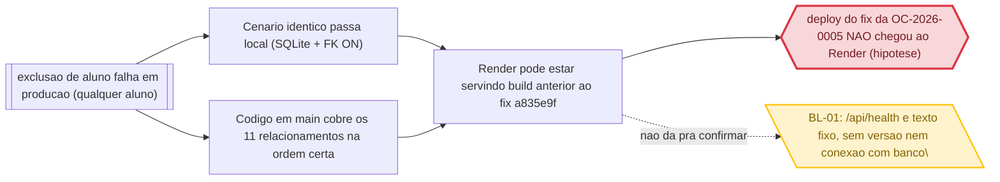

> `regressao_de` so e preenchido com EVIDENCIA de que o codigo causador deste problema foi introduzido ou alterado por aquele trabalho. Coincidencia de arquivo NAO e regressao: sem vinculo causal comprovado, `regressao_de: null` e `evidencia_regressao: null`, e a suspeita vai na prosa (regra 15). Preenchido um, preenchido o outro.

> Frontmatter obrigatorio (expx-schema v1). Formato completo em `references/00-schema.md`. Substitua os marcadores; NUNCA omita uma chave — ausente e `null`, lista vazia e `[]`. Sem acento em chave nem em valor de enum. `atualizado_em` e reescrito a cada gravacao.

## Cadeia da causa

`s` abaixo é a **hipótese mais forte ainda não comprovada** (ver BL-01). O desafio aqui é exatamente que a evidência que fecharia a cadeia (qual build está no ar) não é observável pelo health check atual.



# Causa raiz — OC-2026-0006: Erro persiste ao excluir aluno em produção

> Usado quando `tipo: bug`. Obrigatório PROVAR a causa, não supor. Hipótese sem prova não passa do E1.

STATUS: **NÃO COMPROVADO** (investigação parada no limite BL-01)

## Comportamento atual

Em produção, a exclusão de aluno falha (erro 500/FK relatado pelo usuário) para **qualquer** aluno. Três fatos comprovados:

1. **O código de exclusão em `main` está correto:** `students.py:305-346` apaga, em ordem, FileUpload, Evaluation, Attendance, Certificate, pagamentos (`Payment` via `Installment`s do aluno/carnê), parcelas, carnês (antes das matrículas — ver comentário em `students.py:334-336`), Discount, MaterialSale, FinancialContract, Enrollment e, por fim, o Student.
2. **O cenário mais extremo passa na suíte:** `test_exclusao_cascata.py:55` (`test_excluir_aluno_com_todas_dependencias`) cria aluno com todas as dependências (matrícula, carnê com `enrollment_id`, parcela+pagamento, desconto, upload, responsável, venda de material, contrato, avaliação, frequência, certificado) e exclui com `200` + contagem zero nas 12 tabelas. Suíte 100% verde.
3. **O erro não é de dado específico:** ocorre com qualquer aluno.

A causa raiz **provável** é que o ambiente onde o erro se manifesta (Render) está rodando código **anterior** ao fix da OC-2026-0005 (`a835e9f`), que corrigiu justamente a ordem/cascata das FKs. O commit `a835e9f` (2026-09-11) está em `main`, mas a versão efetivamente servida pelo Render é **desconhecida** — não há instrumentação para observá-la.

## Comportamento esperado

- Excluir qualquer aluno em produção retorna 200 e remove o aluno e suas dependências (mesmo comportamento do teste de regressão verde).
- O ambiente de produção deve expor **qual build está no ar** para que um problema como este seja diagnosticável em minutos: `GET /api/health` (ou `/api/version`) com o commit SHA do deploy.

## A prova

**Evidências que fechariam a hipótese do deploy defasado (hoje indisponíveis — BL-01):**

| Pergunta | Como responder | Disponível hoje? |
|---|---|---|
| Qual commit SHA o Render está servindo? | endpoint de status expondo `GIT_SHA`/versão do build | **Não** (`main.py:259-261` só devolve texto fixo) |
| O build do Render aplicou o `a835e9f`? | comparar SHA do endpoint com `git rev-parse HEAD` em `main` | **Não** |
| O banco de produção aceita a exclusão com a nova ordem? | reproduzir o delete contra o Postgres do Supabase | **Não** (sem credenciais de produção no runx) |

**Provas positivas já colhidas (o que NÃO é a causa):**
- Teste de regressão verde (`test_exclusao_cascata.py:55`) → o código de `main` exclui aluno com todas as dependências.
- Código revisionado linha a linha (`students.py:305-346`) → ordem correta, com o caso `Carne.enrollment_id` tratado explicitamente.

## Regressão

**Sem conclusão:** não dá para afirmar regressão nem não-regressão enquanto o build em produção for desconhecido. Se confirmado que o Render serve código pré-`a835e9f`, o defeito original da OC-2026-0005 (ou o deploy que não propagou o fix) é a origem — a classificação `regressao_de` será reavaliada com a evidência. Suspeita registrada na prosa.

## Arquivos e módulos impactados

> Esta lista TRAVA o escopo: o que não está aqui não é tocado no E3. A OC-2026-0006 **não chegou ao E3** — a causa não está comprovada; o item de instrumentação abaixo é o caminho para desbloquear a prova.

- `backend/app/main.py` — **criar/alterar** exposição de versão no `/api/health` (e/ou `/api/version`): `GIT_SHA` do build + opcionalmente sondagem de conectividade com o banco. Habilita a confirmação da hipótese.
- `backend/Dockerfile` / `render.yaml` — **alterar** para injetar o SHA do commit no build (ARG/ENV `GIT_SHA`).
- `backend/tests/test_health.py` — **alterar** para validar os novos campos de versão.

> Sem a instrumentação acima, a OC fica **bloqueada** — não há como confirmar se o Render serve o fix sem chutar.

## Opções de solução consideradas

| Opção | Trade-off |
|---|---|
| Instrumentar versão no `/api/health` (ex.: `{"status":"ok","git_sha":"..."}`) injetada no build do Render | Habilita a prova em minutos; exige um redeploy — que, aliás, pode já entregar o fix pendente |
| Redeploy manual/nova tentativa de deploy no Render (sem instrumentação) | Pode resolver por acidente, mas não prova nada e a causa segura continuaria invisível |
| Rodar a exclusão real contra o Postgres de produção com as credenciais do Supabase | Prova direta, mas exige acesso ao banco de produção (fora do runx) |

## Decisões

> Formato fixo. Não apague decisões: uma decisão revertida ganha nova linha que cita a anterior.

```
(Em aberto — a OC está parada no E1 até confirmar a causa.)
```

## Como isso será testado

- **Confirmação da hipótese:** após instrumentar versão, `GET https://jgsistemas-backend.onrender.com/api/health` deve retornar `git_sha` — comparável com `git rev-parse HEAD`. SHA igual → causa é outra e a investigação continua; SHA anterior ao `a835e9f` → causa confirmada (deploy defasado/OC-2026-0005 não propagada).
- **Regressão do bug (após o redeploy):** excluir um aluno real em produção (ou aluno de teste com dependências) e conferir 200 + remoção.
- **Suíte:** `pytest` no backend segue 100% verde; `test_health.py` atualizado cobre os novos campos de versão.