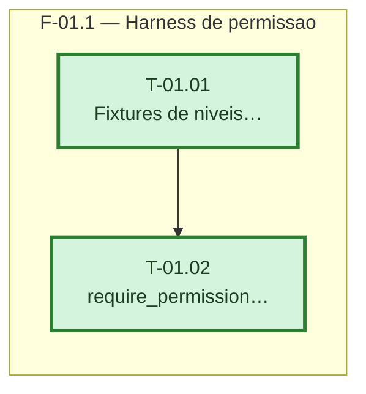

---

## F-01.1 — Harness de permissão

**Objetivo:** Entregar fixtures de usuários com níveis distintos de permissão e o utilitário `require_permission`, sem tocar nenhuma rota de negócio.

**Tasks que a compõem:** T-01.01, T-01.02

**Critério de saída:** `require_permission("financial")` retorna o usuário para `super_admin` e para quem tem o módulo, e levanta 403 para quem não tem — comprovado por teste automatizado.

**Roda em paralelo com:** nenhuma
