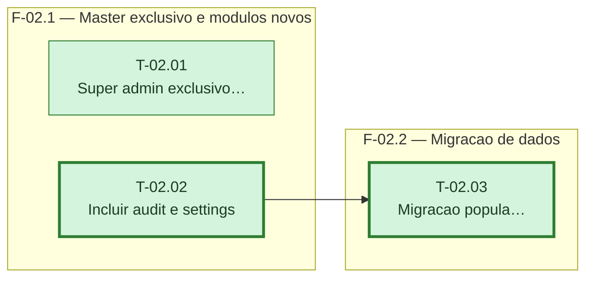

---

## F-02.1 — Master exclusivo e módulos novos

**Objetivo:** Corrigir o bug do super_admin e tornar a gestão de usuários exclusiva dele; ampliar a lista de módulos para 15.

**Tasks que a compõem:** T-02.01, T-02.02

**Critério de saída:** As três rotas de `/auth/users*` só aceitam `super_admin`; `ALL_MODULES`/`ALL_PERMISSIONS` têm 15 chaves.

**Roda em paralelo com:** nenhuma

---

## F-02.2 — Migração de dados

**Objetivo:** Popular `permissions` dos admins existentes com os 15 módulos antes do enforcement real entrar em vigor.

**Tasks que a compõem:** T-02.03

**Critério de saída:** `alembic upgrade head` deixa qualquer admin pré-existente com os 15 módulos em `permissions`.

**Roda em paralelo com:** nenhuma
