```mermaid
%% Grafo de tasks — sprint-03 — gerado pela sprintx a partir de tasks.md
flowchart LR
  subgraph fase_03_1["F-03.1 — Enforcement por modulo"]
    T_03_01["T-03.01<br/>Enforcement students"]
    T_03_02["T-03.02<br/>Enforcement enrollments"]
    T_03_03["T-03.03<br/>Enforcement courses"]
    T_03_04["T-03.04<br/>Enforcement teachers"]
    T_03_05["T-03.05<br/>Enforcement classes"]
    T_03_06["T-03.06<br/>Enforcement attendance"]
    T_03_07["T-03.07<br/>Enforcement evaluations"]
    T_03_08["T-03.08<br/>Enforcement boletins"]
    T_03_09["T-03.09<br/>Enforcement certificates"]
    T_03_10["T-03.10<br/>Enforcement financial"]
    T_03_11["T-03.11<br/>Enforcement schedule"]
    T_03_12["T-03.12<br/>Enforcement dashboard e…"]
    T_03_13["T-03.13<br/>Enforcement audit"]
    T_03_14["T-03.14<br/>Enforcement settings"]
  end

  classDef concluida fill:#d4f4dd,stroke:#2e7d32,color:#1b3d20
  classDef andamento fill:#fff3cd,stroke:#b8860b,color:#4a3800
  classDef bloqueada fill:#f8d7da,stroke:#c62828,color:#4a1d1f
  classDef pendente  fill:#eceff1,stroke:#78909c,color:#263238
  classDef critico   stroke-width:3px

  class T_03_01 concluida
  class T_03_02 concluida
  class T_03_03 concluida
  class T_03_04 concluida
  class T_03_05 concluida
  class T_03_06 concluida
  class T_03_07 concluida
  class T_03_08 concluida
  class T_03_09 concluida
  class T_03_10 concluida
  class T_03_11 concluida
  class T_03_12 concluida
  class T_03_13 concluida
  class T_03_14 concluida
  class T_03_01 critico
```

> Sem arestas: as 14 tasks não dependem umas das outras (todas dependem só de T-01.02/T-02.02, de sprints anteriores) e tocam arquivos completamente distintos — é isso que faz o paralelismo total aparecer. O caminho crítico da sprint tem comprimento 1 (qualquer uma das 14 serve de referência; marcada `T-03.01` por ser a de menor id).

---

## F-03.1 — Enforcement por módulo

**Objetivo:** Cada task aplica `require_permission(<módulo>)` nas rotas de leitura e escrita de um módulo, substituindo `require_role`/`get_current_user` puro.

**Tasks que a compõem:** T-03.01 a T-03.14

**Critério de saída:** `grep -rn "require_role\|get_current_user" backend/app/routes/*.py` não mostra mais autorização de papel puro para dado de negócio nos 15 módulos; `pytest` 0 failed.

**Roda em paralelo com:** nenhuma (é a única fase da sprint)
