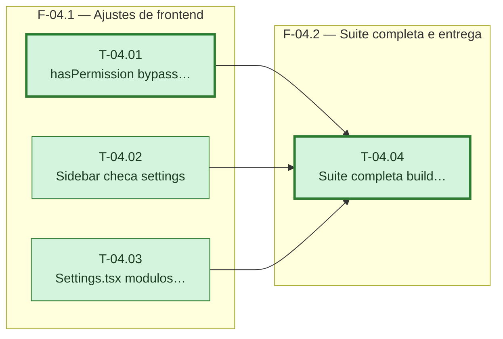

---

## F-04.1 — Ajustes de frontend

**Objetivo:** Refletir na interface que só o `super_admin` tem acesso automático a tudo, e que os 15 módulos são configuráveis para qualquer usuário, inclusive `admin`.

**Tasks que a compõem:** T-04.01, T-04.02, T-04.03

**Critério de saída:** `hasPermission` só dá bypass a `super_admin`; `Sidebar` esconde Configurações sem o módulo; a aba Usuários só existe para `super_admin`.

**Roda em paralelo com:** nenhuma

---

## F-04.2 — Suíte completa e entrega

**Objetivo:** Fechar a feature com a suíte inteira verde, build limpo e commit na main.

**Tasks que a compõem:** T-04.04

**Critério de saída:** `pytest` 0 failed; `vitest` 0 failed; `npm run build` exit 0; commit feito.

**Roda em paralelo com:** nenhuma
